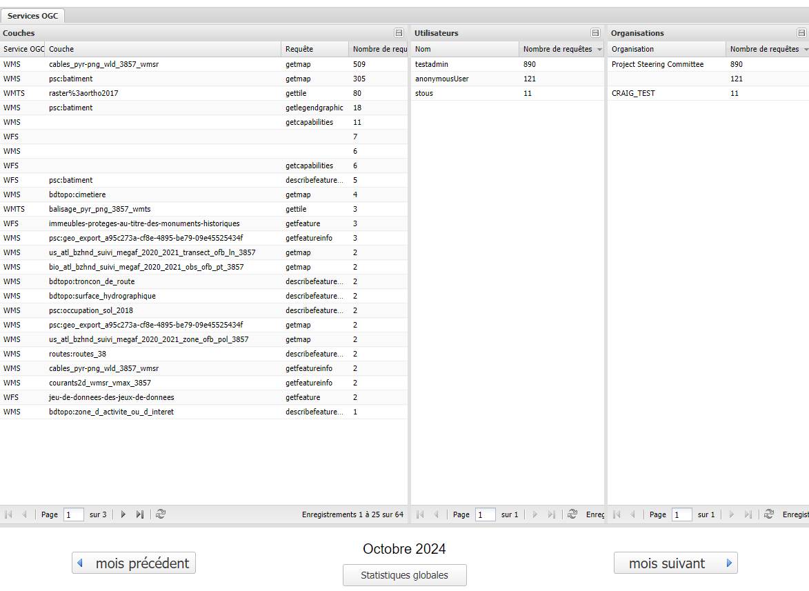

Application
=================

.. contents:: Table des matières
   :local:
   :depth: 1

Le module analytics permet d'analyser les flux OGC donc les données issues des différents service web OGC de GeoServer : 

L'interface permet de connaître :

- le service web, le titre de la couche et la requête
- l'utilisateur et le nombre de requêtes 
- l'organisation et le nombre de requêtes