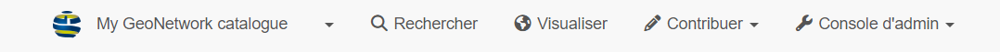
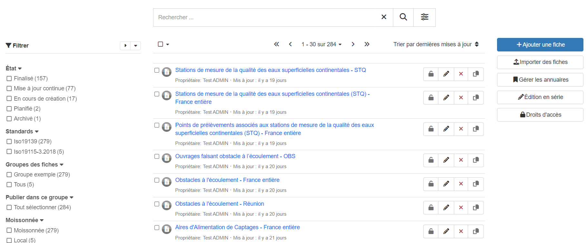
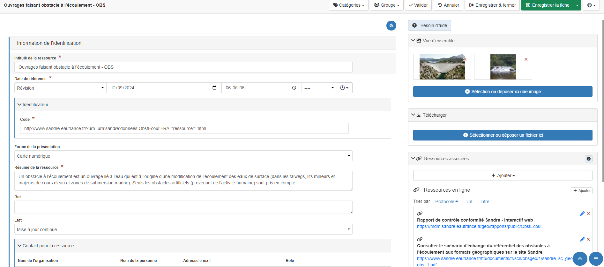
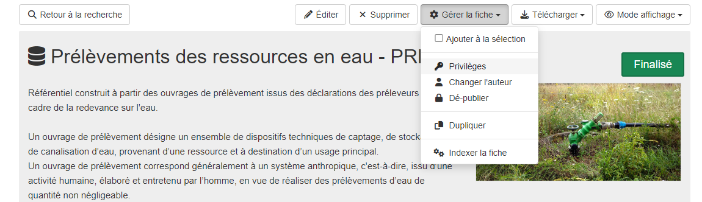
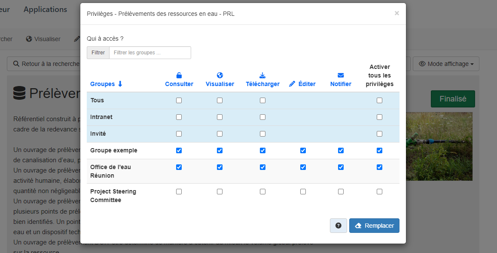
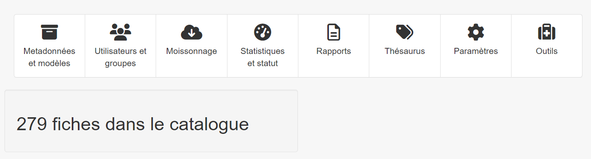

Catalogue - GeoNetwork 
==============================

.. contents:: Table des matières
   :local:
   :depth: 1

Introduction
--------------

La technologie utilisé par le catalogue est GeoNetwork, cette documentation à pour but de se repérer rapidement dans l'interface mais n'a pas 
pour vocation de remplacer la documentation officiel :
https://docs.geonetwork-opensource.org/4.2/user-guide/

Le GeoNetwork est utilisé comme catalogue CSW (Catalogue Service for the Web) ce qui permet de référencer les métadonnées couplées aux flux de données. 

La page principale se compose de 4 composants : la recherche de données, la visualisation, les fiches de métadonnées et l'administration 

La recherche de données est la même que dans le catalogue mais avec l'interface basique de GeoNetwork.
La visualisation renvoie sur le visualisateur qui est MapStore.

Gestion des fiches de métadonnées
-----------------------------------

Dans l'onglet "Contribuer" puis "Accueil édition" : 

Cette section fournit une liste des fiches avec les fonctionnalités associées, vous pouvez éditer les fiches, les supprimer, 
gérer les annuaires (inutile pour geOrchestra), faire de l'édition en série et gérer les droits d'accès.

Dans l'interface d'édition d'une fiche, vous pouvez changez toutes les informations à gauche de l'écran, et ajouter des éléments à droite.
Les ajouts peuvent être des images, des liens ou des ressources qui correspondent à des liens de parentés, des flux OGC ou d'autre. 

Gérer les droits d'accès aux fiches de métadonnées
-----------------------------------------------------------

.. _privileges:

Vous pouvez restraindre l'accès aux fiches de métadonnée, les fiches sont automatiquement visible pour toutes les organisation de l'infrastructure.
Mais si vous aller dans la fiche de métadonnée que vous voulez modifier, allez dans"Gérer la fiche" puis "Privilèges" et vous pourrez modifier les 
différents droit en fonction des organisations :

Vous pouvez modifier l'accès à la consultation simple ou encore, la visualisation, le téléchargement, l'édition ou la notification en fonction des organismes.

Administration
---------------------------

.. contents::
   :local:
   :depth: 1

Pour ce qui est de l'administration, elle est divisé en 8 catégories : 

Métadonnées et modèles 
~~~~~~~~~~~~~~~~~~~~~~~~

 La page "Métadonnées et modèle" sert à définir les modèles de fiches de métadonnées à utiliser : 

 .. image:: ../images/admin_cat/cat_modele.png
   :alt: Capture d'écran du catalogue  
   :align: center
   :width: 700px

Les modèles de fiche de métadonnées sont gérées automatiquement par le module d'import de geOrchestra. 

Utilisateur et groupe
~~~~~~~~~~~~~~~~~~~~~~~~

 .. image:: ../images/admin_cat/cat_user.png
   :alt: Capture d'écran du catalogue  
   :align: center
   :width: 700px

Les utilisateurs et les organisation sont gérés dans la page :ref:`Utilisateur <utilisateur>`

Moissonnage
~~~~~~~~~~~~~~~~~~~~~~~~

 .. image:: ../images/admin_cat/cat_moisson.png
   :alt: Capture d'écran du catalogue  
   :align: center
   :width: 700px

Le moissonnage est très utile car il permet de référencer les fiches de métadonnées d'un autre catalogue sur le GeoNetwork interne. 
Il faut connaître la technologie du catalogue que l'on veut référencer, renseigné l'url puis les différentes filtres que l'on veut appliquer.
Il est aussi possible de plannifier le moissonnage. 

Les moissonnage sont différents en fonction de la technologie du catalogue cible. 
Voici la documentation officiel pour chaque technologie : 

https://docs.geonetwork-opensource.org/4.2/user-guide/harvesting/

Statistique et statut
~~~~~~~~~~~~~~~~~~~~~~~~

 .. image:: ../images/admin_cat/cat_stats.png
   :alt: Capture d'écran du catalogue
   :align: center
   :width: 700px

Cette section permet de connaître l'état du système très rapidement. L'analyse des liens scanne tous les liens des métadonnées, le versionnement permet de connaître l'état 
d'une métadonnée précise. 

Rapports
~~~~~~~~~~~~~~~~~~~~~~~~

 .. image:: ../images/admin_cat/cat_rapport.png
   :alt: Capture d'écran du catalogue
   :align: center
   :width: 700px

La partie rapport permet de créer des rapports très rapidement : 

- sur la mise à jour des fiches 
- sur les fiches stockées en interne 
- sur l'ajout de fichier dans les fiches 
- sur l'historique des fiches 
- sur les accès utilisateurs

Thésaurus
~~~~~~~~~~~~~~~~~~~~~~~~

 .. image:: ../images/admin_cat/cat_thes.png
   :alt: Capture d'écran du catalogue
   :align: center
   :width: 700px

Le thésaurus est le dictionnaire à mots clés, il définit les mots clés que vous pouvez utiliser pour vos métadonnées.

Paramètres
~~~~~~~~~~~~~~~~~~~~~~~~

 .. image:: ../images/admin_cat/cat_param.png
   :alt: Capture d'écran du catalogue
   :align: center
   :width: 700px

Dans cet onglet se trouve les paramètres pour la configuration système dont voici la documentation en details : 

https://docs.geonetwork-opensource.org/4.2/fr/administrator-guide/configuring-the-catalog/system-configuration/

Sur cette partie se trouve aussi les paramètre pour changer l'interface utilisateur, changer le style, ajouter des logos, gérer les différents catalogues moissonnés,
gérer les différentes langues, activer et tester le CSW, ajouter des serveurs cartographiques type GeoServer et ajouter des pages statiques. 

Outils
~~~~~~~~~~~~~~~~~~~~~~~~

 .. image:: ../images/admin_cat/cat_outil.png
   :alt: Capture d'écran du catalogue
   :align: center
   :width: 700px

Cette partie permet d'inéragir avec les index d'elasticsearch qui est le moteur de recherche derrière GeoNetwork. Cela permet de relancer l'indexation des données si
l'on pense que des problèmes ont été réglé. ll ne faut globalement pas cliquer sur ces boutons. 

