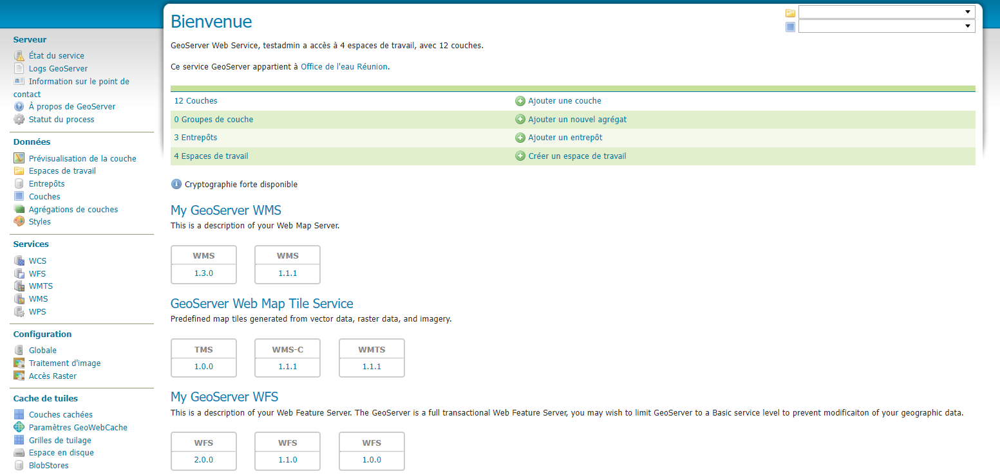
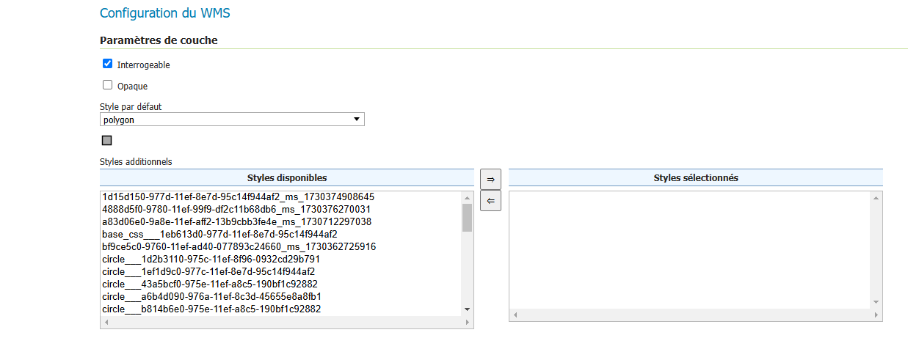
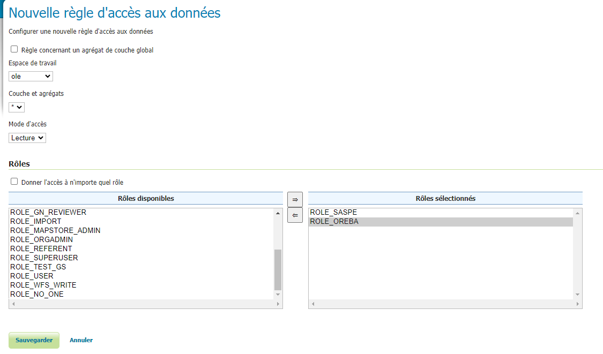
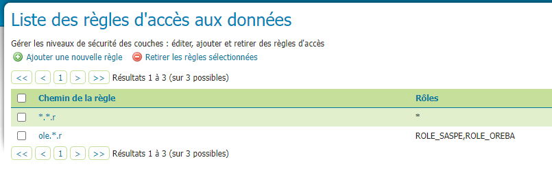
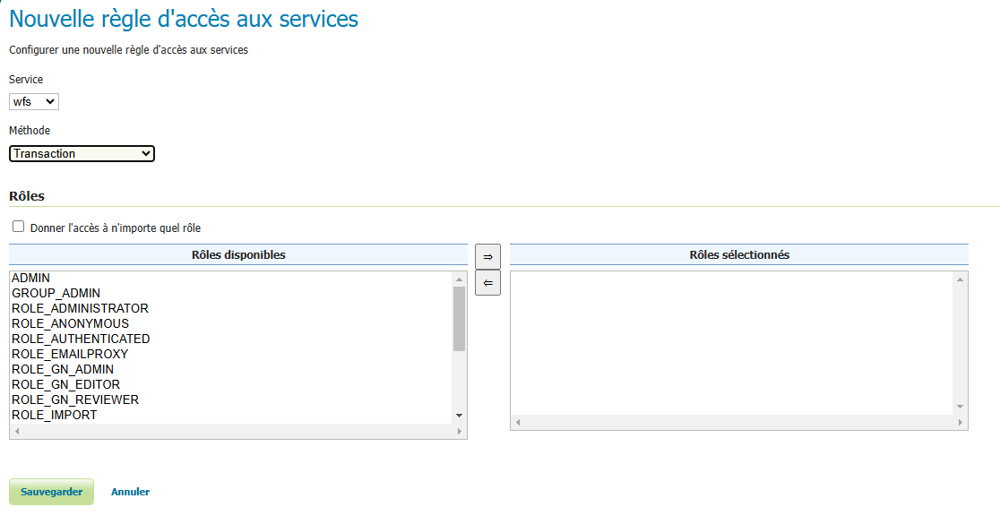

Services - GeoServer
================================

.. contents:: Table des matières
   :local:
   :depth: 1

Introduction
----------------

Cette page est l'interface de GeoServer, le GeoServer est la technologie qui permet de diffuser les données stockées en interne via des webs services.
Voici la documentation officiel : 
https://docs.geoserver.org/

Vous n'avez normalement pas à intervenir dans cette page, à part pour des changements sur la configuration des différents flux. 

Les données stockées en interne
------------------------------------------

GeoServer est directement connecté à une base de données PostGIS et diffuse les données internes : 

|espace|

Les données sont organisées en "espaces de travail" qui prend le nom de l'organisation à qui appartient la donnée, puis est reliée à un entrepot, qui est l'emplacement
dans la base de données de là où est stocké la donnée. Cette organisation et ce stockage se fait automatiquement avec le module d'importation de geOrchestra. 

La diffusion des données avec les flux OGC 
---------------------------------------------------

Lorsqu'une donnée est intégrée dans geOrchestra via le module d'intégration, deux types de services sont créés : un flux WMS (Web Map Service) 
et un flux WFS (Web Feature Service).

WMS (Web Map Service) : Ce service permet de représenter la donnée sous forme de cartes raster (images générées à partir des données géospatiales). 
Les couches WMS sont souvent utilisées pour l'affichage dans des visualiseurs cartographiques, car elles sont légères et rapides à charger.

WFS (Web Feature Service) : Ce service permet d'accéder aux données vectorielles, offrant la possibilité de requêter et de manipuler directement 
les entités géospatiales (points, lignes, polygones). Le WFS est essentiel pour effectuer des requêtes sur les objets géospatiaux et obtenir des informations 
précises sur ces entités.

Ces services sont conformes aux normes européennes et permettent une interopérabilité entre différents modules et systèmes. Lorsqu'une 
donnée apparaît sur le visualiseur, elle est généralement issue du flux WMS pour des raisons de performance, car les données raster sont plus 
rapides et moins gourmandes en ressources. Toutefois, le flux WFS est crucial pour permettre des interactions plus détaillées, telles que des requêtes sur les entités.
Vous pouvez configurer ces flux dans GeoServer en accédant aux paramètres du service, par exemple pour définir les autorisations ou activer/désactiver la 
transformation du système de coordonnées de référence (CRS). Cela vous permet de contrôler précisément comment les données sont diffusées et utilisées au sein de la plateforme.

Définir des styles pour les flux WMS
-----------------------------------------------

Vous pouvez définir des styles dans l'onglet "Styles" de GeoServer puis les attribuer aux couches en allant dans "Couches", une fois une couche
sélectionnée, allez dans "Publication" et vous avez "Style par défaut" : 

|espace|

La restriction d'accès aux données
-----------------------------------------------

La manipulation des droits se fait normalement dans l'onglet :ref:`Utilisateur <utilisateur>`. La seule chose qui ne peut pas se faire dans cette page
est la restriction d'accès aux données, qui se fait, pour les métadonnées dans l'onglet :ref:`privilèges <privileges>`
 
Par défaut, toutes les données et les ressources dans GeoServer sont accessibles à tous les utilisateurs. 
Pour gérer l'accès, des restrictions spécifiques peuvent être appliquées par la suite : 

|espace|

**Définir l'espace de travail** : Spécifiez l'espace de travail concerné. Dans cet exemple, nous utilisons l'espace de travail "ole", 
qui contient les données intégrées par l'Office de l'eau.

**Cibler les données** : Indiquez les données que vous souhaitez restreindre. Pour cibler toutes les données, vous pouvez utiliser le symbole "*".

**Type d'accès** : Sélectionnez le type d'accès à restreindre. Dans cet exemple, nous choisissons l'accès en lecture.

**Définir les rôles** : Précisez les rôles qui auront accès à cette sécurité. Ici, nous incluons les rôles "SASPE" et "OREBA".

Avec cet exemple, seulement les utilisateurs qui possèdent le rôles "SASPE" et/ou "OREBA" peuvent visualiser les flux des données de l'espace de travail "ole"
qui correspond aux données de l'Office de l'eau Réunion. 

Ce qui en resulte par cette interface et les règles suivantes : 

- toutes les données sont lisible par tous les groupes, mais par dessus vient s'ajouter :
- les données de l'Office de l'eau Réunion ne sont lisible que par les utilisateurs qui sont dans les groupes OREBA et/ou SASPE

La restriction d'accès aux services
-----------------------------------------------

Pour restreindre les accès aux différents services, par exemple modifier les données directement via mapstore se fait via le service WFS et la fonction "Transaction".

L'accès à la création de compteur via mapstore se fait via le service wps qui permet de réaliser des traitements géospatiaux directement via des requêtes HTTP. 

.. |espace| unicode:: 0xA0 