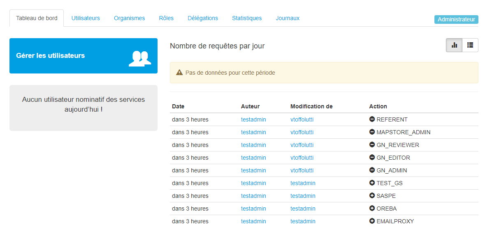
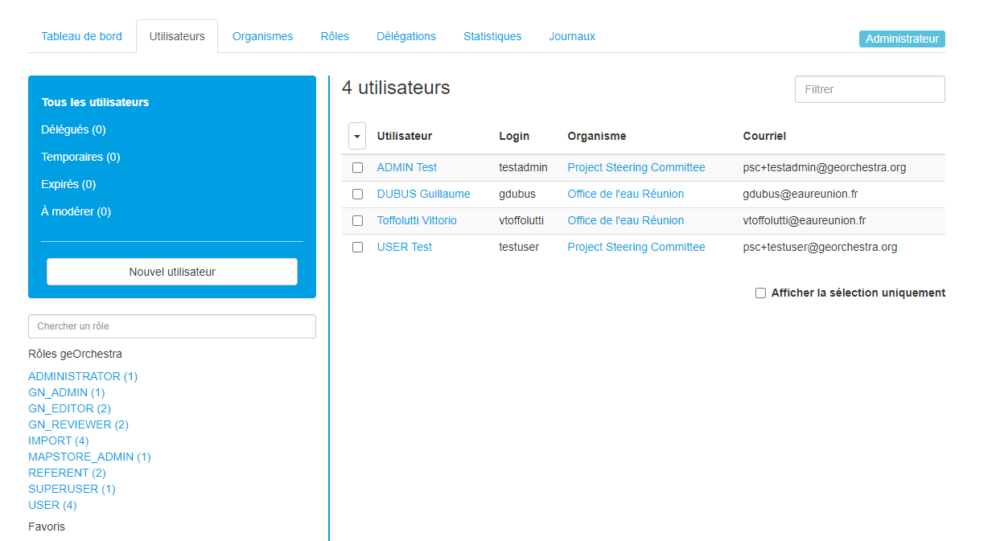
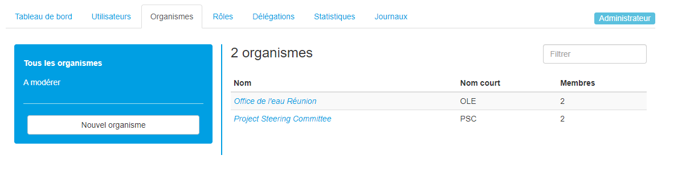
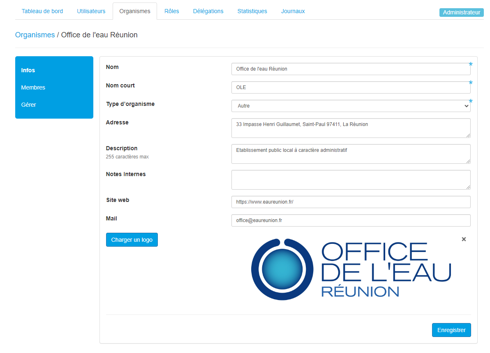
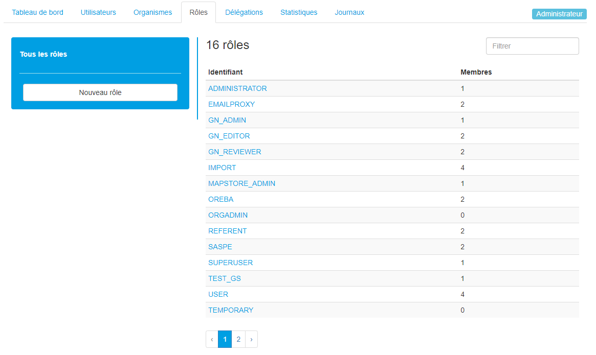

Utilsateur - console admin
=====================================

.. _utilisateur:

.. contents:: Table des matières
   :local:
   :depth: 1

Introduction
------------

La console d'admin sert à gérer les utilisateurs, les droits, et voir les activités des utilisateurs. 
Chaque utilisateur est reliée à une organisation, et les accès sont organisés par des rôles qui sont prédéfinis. 
Vous pouvez ajouter, modifier ou supprimer des rôles en fonction des utilisateurs.

La première page est le "Tableau de bord" avec le récapitulatif des actions passées, les utilisateurs en attente de validation, 
et permet de voir qui s'est connecté sur la journée. 

|espace|

Utilisateurs
-----------------------

Cette section permet de voir la liste des utilisateurs et leurs informations : 

|espace|

En cliquant sur un utilisateur vous pourrez modifier ses caractéristiques : 

.. image:: ../images/admin_user/user_user_user.png
   :alt: Capture d'écran du catalogue 
   :align: center
   :width: 700px

|espace|

C'est aussi dans cet onglet que vous pouvez accepter des nouveaux utilisateurs, changer les noms des utilisateurs et aussi renvoyer la modification de mot de passe
par mail. 

Ne jamais supprimer l'utilisateur par défaut : Import DATAFEEDER, ce rôle est nécéssaire au fonctionnement du module datafeeder.

Organismes
---------------------------

Les utilisateurs sont obligatoirement rattachés à une organisation : 

|espace|

Si vous cliquez sur une organisation, vous pouvez modifier ses informations ainsi que ses membres : 

|espace|

Rôles 
-----------------------

Les rôles permettent de regrouper les utilisateurs et de leur donner des accès et droits : 

|espace|

Certain rôles définissent des accès particulier et il est possible de créer des groupes en plus pour regrouper des utilisateurs entre eux. 

Les rôles principaux sont : 

- **SUPERUSER** : accès à la console d'admin
- **ADMINISTRATOR** : permet d'accéder au module admin de GeoServer et permet de créer des styles dans Mapstore avec le rôle MAPSTORE_ADMIN
- **GN_ADMIN** : permet d'accéder au GeoNetwork qui est le module admin du catalogue
- **GN_EDITOR** : permet d'éditer les fiches dans GeoNetwork
- **GN_REVIEWER** : permet de publier des données à la main dans GeoNetwork
- **MAPSTORE_ADMIN** : permet d'accéder au module admin de Mapstore, et permet aussi de modifier le style d'un WMS avec le rôle ADMINISTRATOR
- **USER** : permet de se log dans geOrchestra et d'enregister des cartes, dashboards et GeoStories dans Mapstore
- **REFERENT** : permet de modifier les informations de son organisme
- **IMPORT** : donne accès au module d'import de données dans geOrchestra

On peut très bien ajouter des rôles, par exemple les rôles OREBA et SASPE, il faut ajouter le rôle OREBA et SASPE au utilisateurs qui appartiennent à ces services.
Puis si l'on veut partager des cartes dans Mapstore et ne les rendre visible ou éditable seulement par un service, il faudra spécifier le groupe en question. 

Ou encore créer des groupe pour restraindre l'accès à certaines données avec GeoServer. 

Autres : 
-------------------------------

- **Délégation** : sert à donner, à un utilisateur, le droit de promouvoir un autre utilisateur avec des rôles spécifiques
- **Statistique** : permet de voir le nombre de requêtes par jour, et les couches les plus consultées
- **Journaux** : permet d'accèder à l'historique des actions de la console d'admin

.. |espace| unicode:: 0xA0 