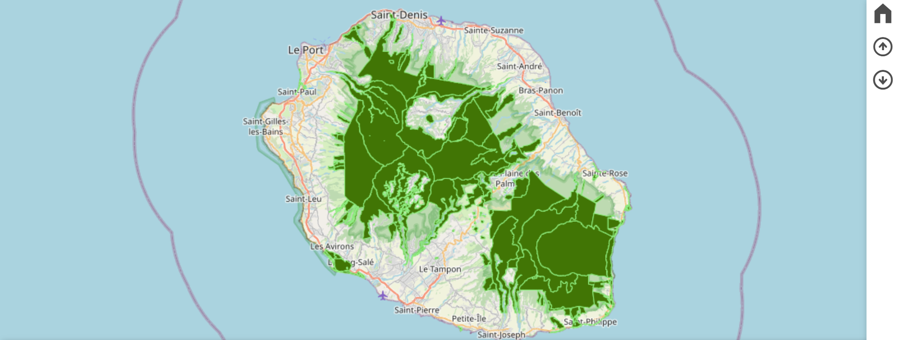
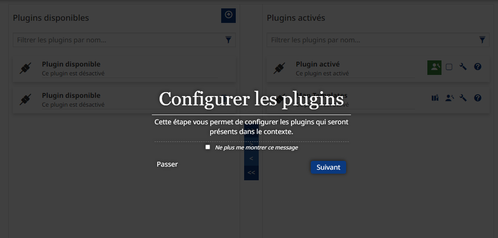

MapStore
=================

.. contents:: Table des matières
   :local:
   :depth: 1

Introduction
------------

La partie administrateur du module Mapstore ajoute peu de fonctionnalités, la seule fonction en plus est la création de contextes.

Les contextes
-----------------------

Les contextes permettent de créer des cartes en choisissant l'interface finale pour par exemple rendre la carte plus abordable et moins technique. 
Par exemple avec ce contexte qui ne presente que le bouton accueil, télécharger et importer : 

Un tutoriel est automatiquement lancé lorsque vous créer un contexte et vous guide pas à pas dans la création
Il faut commencer par choisir un titre, une description, ajouter les données que l'on veut afficher,
et choisir les fonctions : 

Les fonctions à choisir sont explicite et facile à comprendre.
Enfin il reste à enregister le contexte pour le rendre disponible aux groupes que l'on veut. 
