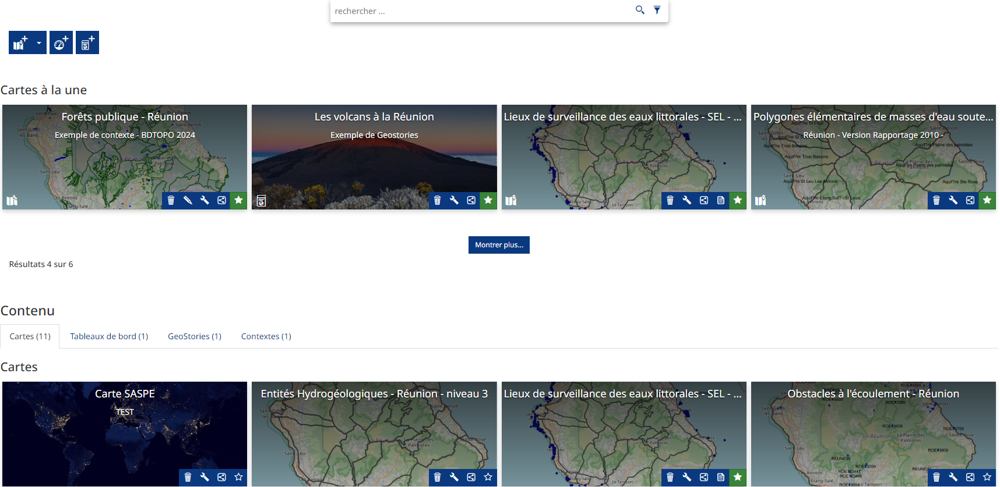
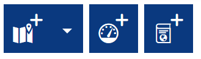
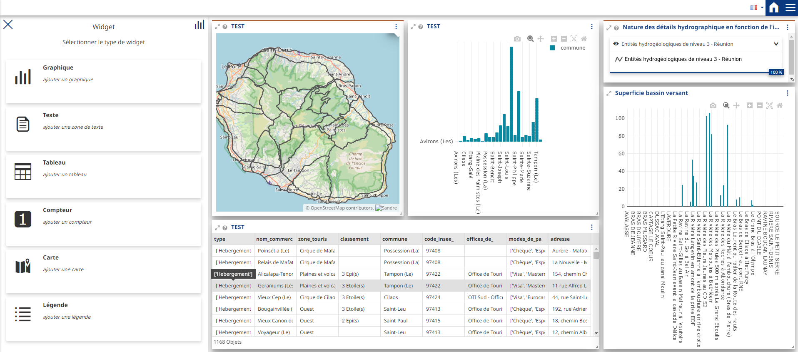
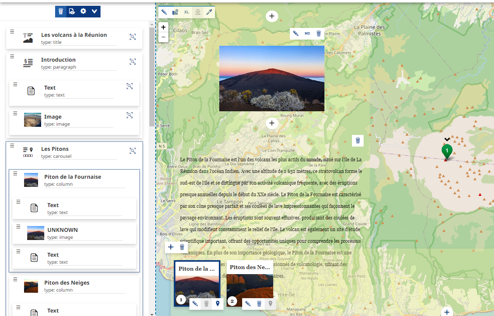

La cartothèque - page Application
====================================

.. _application:

.. contents:: Table des matières
   :local:
   :depth: 1

Introduction
------------

La page Application sert de cartotèque en lien avec le :ref:`visualiseur <visualiseur>`. Dans cette cartothèque, 4 types de representations sont possibles :
la carte simple avec le visualiseur, le tableau de bord, la GeoStory et le contexte réservé aux administrateurs. Voici les 3 boutton pour ajouter dans l'ordre,
une carte, un Dashboard et une GeoStory : 

|espace|

Dans cette cartothèque, 4 types de representations sont possibles :
la carte simple avec le visualiseur, le tableau de bord, la GeoStory et le contexte réservé aux administrateurs. 

Dashboard
-----------------------

|espace|

Vous pouvez ajouter différents widget en fonctions des données du catalogue, un tutoriel vous guide directement lorsque vous créer un dashboard, les graphiques
réalisables sont les mêmes que pour les cartes.

.. note::
   Les widgets sont dépéndants de la configuration de la donnée, ils peuvent ne pas être disponible. 

Voici le lien de la documentation officiel pour aller dans le détail : 

`Documentation Mapstore Dashboard <https://docs.mapstore.geosolutionsgroup.com/en/v2024.01.02/user-guide/exploring-dashboards/>`_

GeoStory
---------------------------

|espace|

Avec les GeoStories, vous pouvez créer des documents textes en y intégrant des cartes intéractives. La gestions des composants se fait sur la gauche
de l'interface qui sont : les titres, les bannières, les paragraphes, les sections immersives, les geocarrousels, les sections multimedia et les pages web.
Un tutoriel vous guide directement lorsque vous créez une GeoStory.

Voici le lien de la documentation officiel pour aller dans le détail : 

`Documentation Mapstore GeoStory <https://docs.mapstore.geosolutionsgroup.com/en/v2024.01.02/user-guide/exploring-stories/>`_

.. |espace| unicode:: 0xA0 

