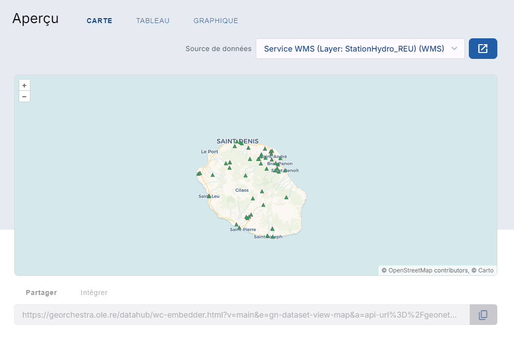
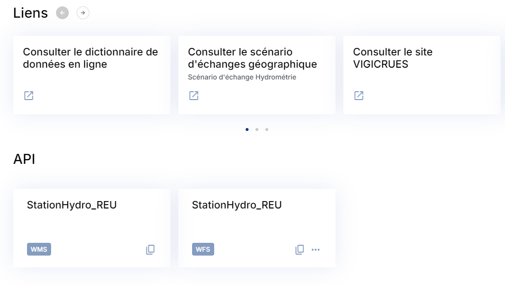

Catalogue
==============================

.. contents:: Table des matières
   :local:
   :depth: 1

Introduction
------------

Les données de ce catalogue proviennent de différents catalogue nationaux mais peuvent aussi être propre à l'Office de l'eau Réunion.
Chaque donnée est reliée à une organisation et possède une description détaillée. 

La recherche de donnée dans le catalogue 
---------------------------------------------

Il y a 3 onglets dans ce catalogue :

- **ACCUEIL** pour afficher les dernières données postées

- **DONNEES** pour afficher toutes les données

.. image:: ../images/user_catalogue/catalogue_donnees.png
   :alt: Capture d'écran du catalogue
   :align: center
   :width: 600px

- **ORGANISATION** pour afficher toutes les organisations qui possèdent des données

Vous pouvez filtrer vos recherches en fonction :

- de la date de publication
- du type de données
- du format
- de l'organisation qui l'a publiée
- des mots clés associés
- ou encore du type de licence si elle est renseignée

Les fonctionnalités des fiches de données
-----------------------------------------

.. contents:: Table des matières
   :local:
   :depth: 1

Lorsque vous cliquez sur une donnée, la page de description de cette donnée s'affiche. 

Description de la donnée
~~~~~~~~~~~~~~~~~~~~~~~~

Le haut de la page est dédiée à la description de cette donnée.
Il y'a :

- un titre
- une description
- la dernière date de la mise à jour,
- son point de contact
- le catalogue dont elle provient
- les mots clés associés
- un pourcentage à titre indicatif de la qualité de cette donnée
- et d'autre informations plus technique

Prévisualisation de la donnée
~~~~~~~~~~~~~~~~~~~~~~~~~~~~~

Une interface de prévisualisation est aussi accessible si vous descendez la page.
Cette interface permet de :

- prévisualiser la donnée

- visualiser le tableau attributaire

- faire différents graphiques en fonction des attributs 

.. image:: ../images/user_catalogue/fiche_graphe.png
   :alt: Options de filtrage
   :align: center
   :width: 600px

.. note::
   La couche de donnée, le tableau ou encore le graphique peuvent ne pas s'afficher car la donnée est mal configurée coté serveur. 

Téléchargement de la donnée
~~~~~~~~~~~~~~~~~~~~~~~~~~~

Vous pouvez aussi télécharger la donnée sous différents formats :

.. image:: ../images/user_catalogue/fiche_tele.png
   :alt: Options de filtrage
   :align: center
   :width: 600px

Mais aussi avoir accées à d'autres liens et URL, ainsi qu'aux flux OGC disponibles : 

.. note::
   Ces liens sont dépendants de la qualité de la donnée et de son intégration, ils peuvent ne pas fonctionner. 

Vous pouvez aussi visualiser la donnée dans une interface cartographique en cliquant ici et cela vous fera apparaître le :ref:`visualiseur <visualiseur>`.

.. image:: ../images/user_catalogue/fiche_carto.png
   :alt: Options de filtrage
   :align: center
   :width: 600px

