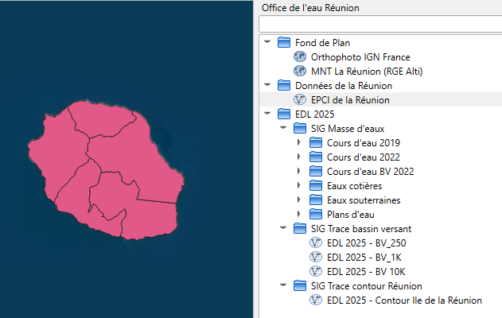
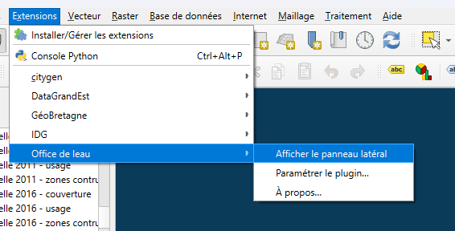
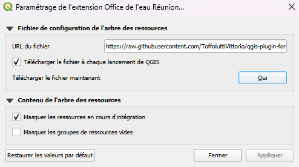

Le plugin QGIS
==========================

Le module QGIS vous permet d'intéragir avec certaines données de la plateforme directement dans QGIS.
Le but est de mettre à disposition des données de référence stable et sans pouvoir les modifier.
Il suffit de double cliquer sur une couche pour l'afficher sur QGIS.

|espace|

Les couches sont choisis par le service informatique, n'hésitez pas à faire des demandes pour que certaines couches se retrouve sur cette interface. 

Pour installer le plugin, demandez au service informatique de vous fournir le document zip qui contient le code du plugin et le copier coller dans 
le repertoire ``C:\Users\votre_nom\AppData\Roaming\QGIS\QGIS3\profiles\default\python\plugins`` et dézipper le. Puis relancer QGIS, vous verrez l'interface 
à droite de l'écran, si il n'apparait pas directement ou si vous l'avez supprimé, vous pouvez l'afficher en cliquant sur "Extensions", "Office de l'eau" 
puis "Afficher le panneau latéral" : 

|espace|

Puis, dans les paramètres de l'extension (menu Extensions  Office de l'eau > Paramétrer le plugin), il faut cocher 
"Télécharger le fichier à chaque lancement de QGiS" :

|espace|

.. note::
   Les données afficher dans qgis sont séléctionnées par le service informatique, si vous voulez ajouter des données,
   veillez demander au service informatique.

.. |espace| unicode:: 0xA0 