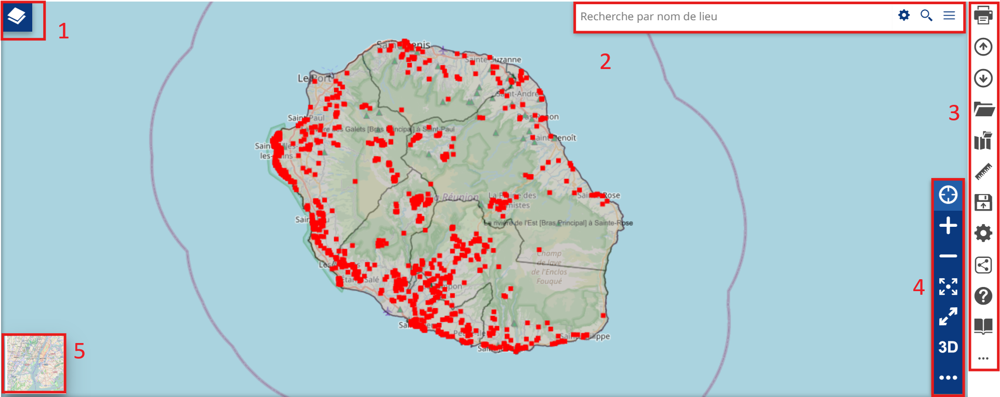
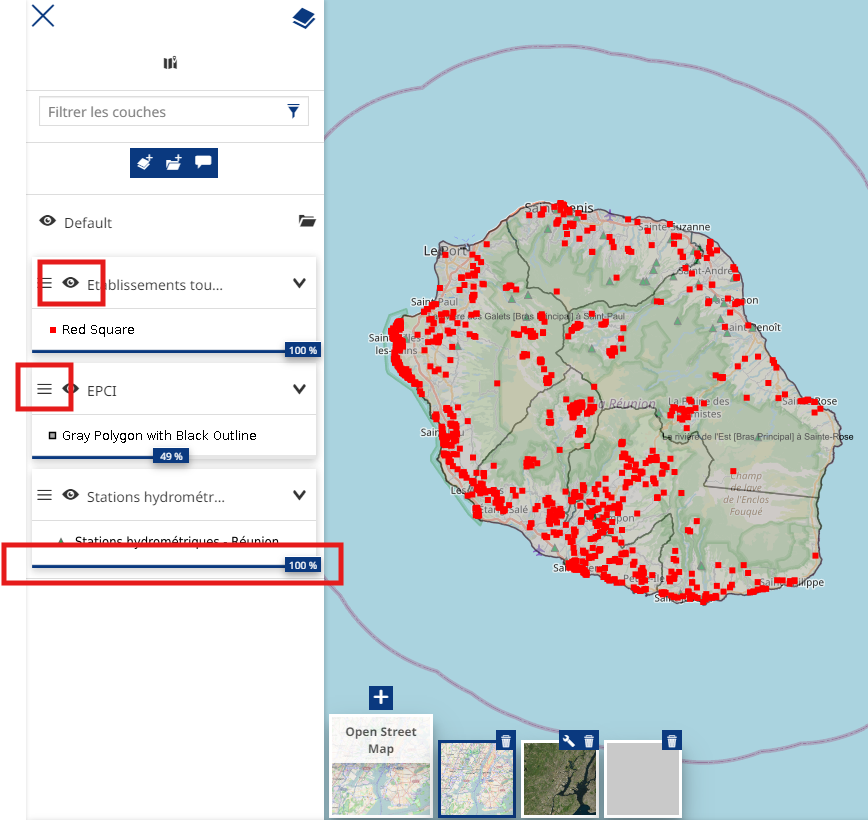
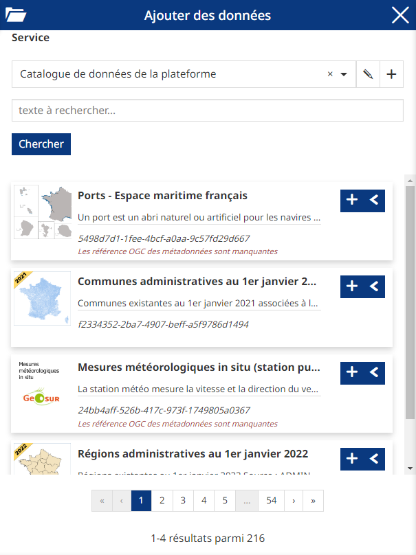
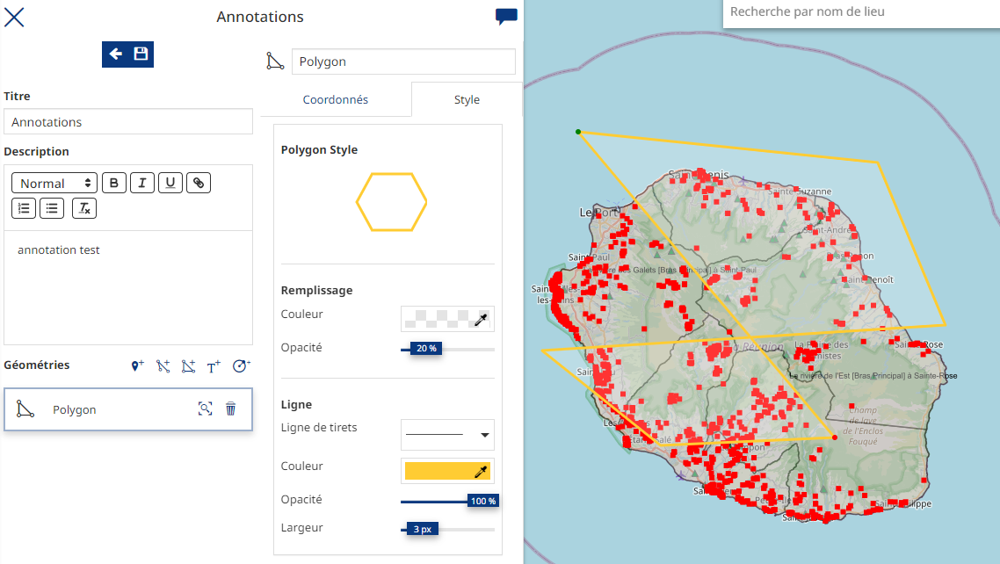
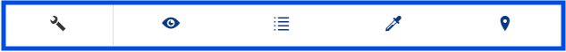
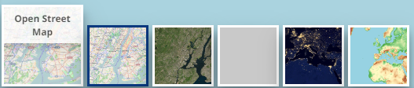
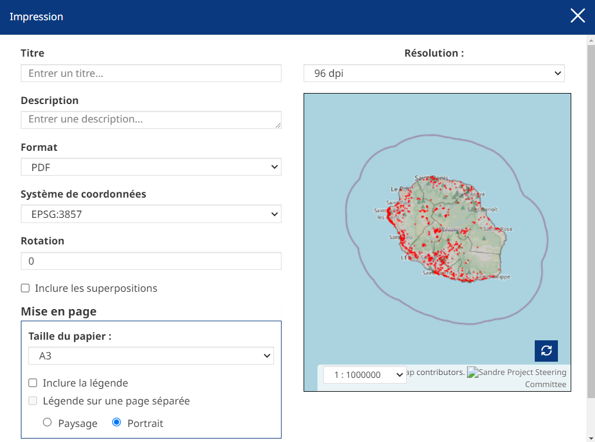
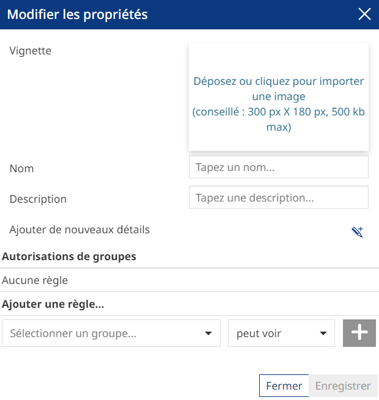

Visualiseur
====================

.. _visualiseur:

.. contents:: Table des matières
   :local:
   :depth: 1

Introduction
------------

Le module cartographique de cette plateforme permet de présenter des couches de données géographiques dans un environnement technique. 
Cette interface permet de représenter plusieurs couches géographiques mais ne peut pas se substituer à l'utilisation complète d'un outil SIG bureautique type QGIS.

L'interface se présente comme ceci : 

- 1 : l'arborescence des couches 
- 2 : recherche d'un lieu 
- 3 : les fonctionnalités 
- 4 : les outils de navigation
- 5 : les fonds de plans

.. note::
   La donnée peut ne pas s'afficher si elle n'est pas disponible ou alors dans le mauvais référentiel de coordonnée.

La gestion des couches
----------------------------------

Si vous cliquez sur 1, l'arborescence des couches va apparaître et vous pourrez : 

- rendre visible ou non la couche
- modifier l'ordre des couches 
- modifier l'opacité en pourcentage

Dans cet onglet, vous pouvez, à l'aide de ces 3 boutons : 

- ajouter des données, ce qui ouvrira cette onglet : 

Dans cet onglet vous pouvez choisir le catalogue, chercher par mots clés puis ajouter la donnée

- ajouter des groupes pour vos données
- créer des annotations : 

Lorsque vous cliquez sur une couche, plusieurs fonctions apparaissent : 

- zoomer sur la couche 
- gérer les réglages de la couche : 

Dans ces réglages vous pouvez modifier, les informations, l'affichage, filtrer les champs, le style et les informations attributaires. 

- filtrer les couches
- ouvrir la table attributaire 
- supprimer la couche
- créer un widget
- exporter la couche
- voir les métadonnées

.. note::
   Les options sont dépendantes de la donnée, elle peuvent ne pas être toutes disponible en fonction de la donnée. 

Pour les fonds de plans, vous pouvez en changer en cliquant sur l'imagette en bas à gauche; : 

Les fonctionnalités techniques
--------------------------------------------------

Pour ce qui est des différentes fonctionnalités :

Dans l'ordre, vous pouvez : 

- imprimer une réalisation : 

Choisir le titre, le format et si la légende apparaît ou non 

.. note::
   Ne marche pas pour l'instant. 

- importer des données
- exporter la carte au format WMC 
- ajouter des données
- charger des cartes déjà enregistrées 
- mesurer des distances 
- enregistrer la carte : 

Vous pouvez choisir une imagette, le titre, vous pouvez aussi, en cliquant sur le crayon, définir un texte qui sera visible à l'ouverture de la carte.
Pour définir des droits de lecture et d'édition, vous devez sélectionner un groupe et spécifier si il à les droits de lecture ou d'écriture.
L'enregistrement ira dans la page :ref:`Application <application>`.

- voir les réglages
- partager la réalisation
- voir la documentation
- faire le tutoriel 
- effacer la session
