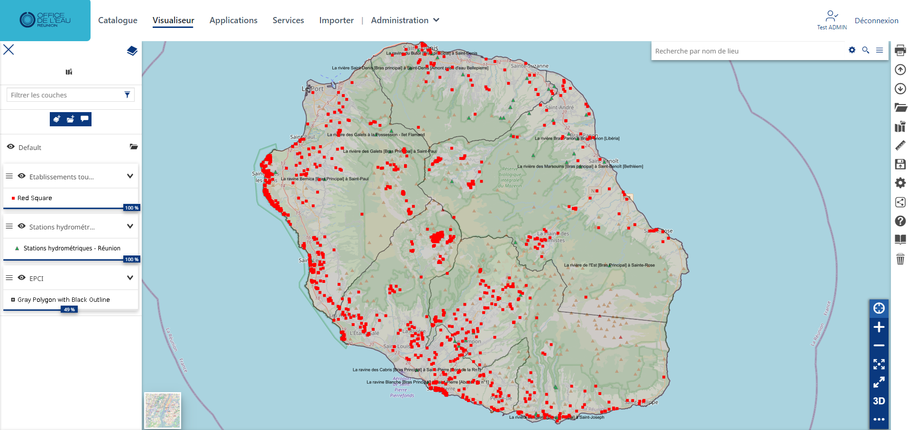
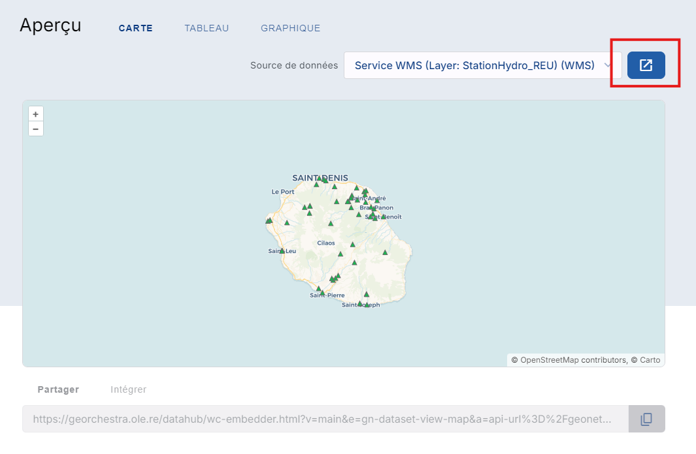

Visualiseur
====================

.. _visualiseur:

.. contents:: Table des matières
   :local:
   :depth: 1

Introduction
------------

Le module cartographique de cette plateforme permet de présenter ces couches de données dans un environnement plus technique. 
Cette interface permet de représenter plusieurs couches géographique mais ne peut pas se substituer à l'utilisation complète d'un outil SIG bureautique type QGIS.

Interface de visualisation
----------------------------------

L'interface se présente comme ceci : 

Section 2 : Fonctionnalités
---------------------------

Il y'a deux façons d'ajouter des données dans cette interface : 

- directement depuis le catalogue 

- ou depuis l'interface 

